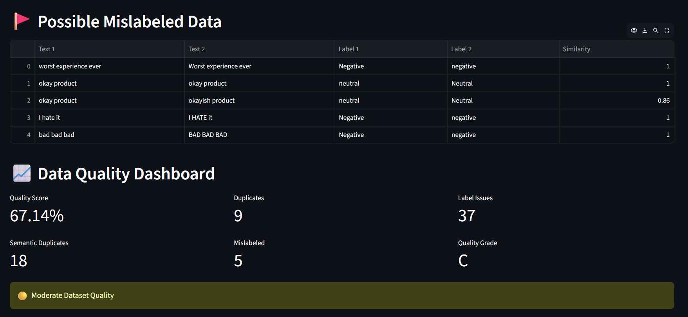
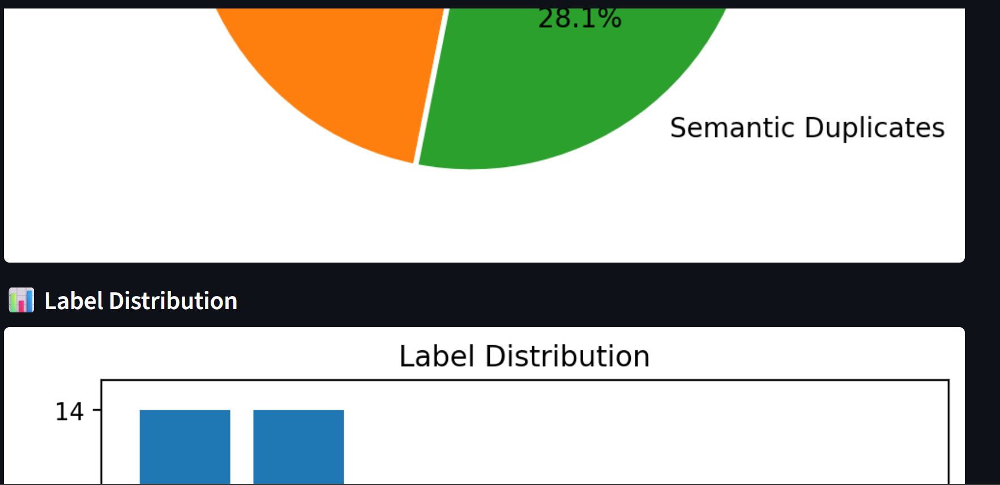
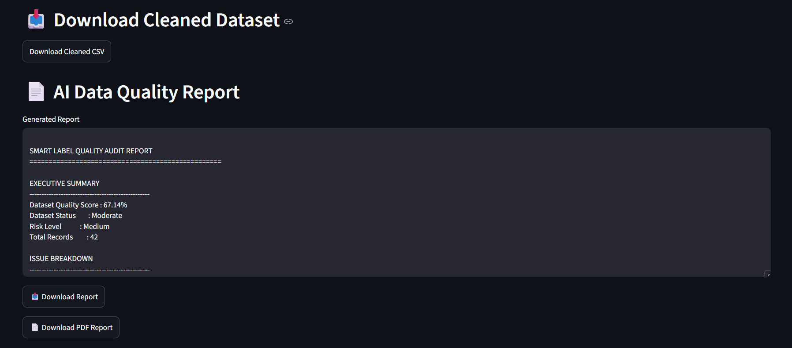

# 🧠 Smart Label Quality Checker

An AI-powered data quality assessment platform designed to detect annotation errors, duplicate records, semantic duplicates, mislabeled samples, and data inconsistencies in machine learning datasets.

The application helps data annotators, ML engineers, and AI practitioners improve dataset quality before model training through automated quality analysis, visual dashboards, AI-powered recommendations, and downloadable reports.

---

## 🚀 Features

### 🔴 Duplicate Detection

Detects exact duplicate records within uploaded datasets.

### 🟡 Label Consistency Check

Identifies inconsistent labels such as:

* Positive
* positive
* POSITIVE

and recommends standardization.

### 🧠 Semantic Duplicate Detection

Uses Sentence Transformers and Cosine Similarity to detect records with similar meanings even when the text is not identical.

Example:

* "I love this product"
* "This product is amazing"

### 🚩 Mislabeled Data Detection

Detects semantically similar records having different labels.

Example:

* "I love this product" → Negative
* "This product is great" → Positive

### 📈 Data Quality Dashboard

Provides:

* Dataset Quality Score
* Dataset Quality Grade
* Duplicate Count
* Label Issues
* Semantic Duplicates
* Mislabeled Records

### 📊 Interactive Visualizations

#### Issue Distribution Pie Chart

Displays dataset quality issue breakdown.

#### Label Distribution Bar Chart

Shows class distribution and dataset balance.

### 🤖 AI Auto-Fix Suggestions

Provides intelligent recommendations for improving dataset quality.

Examples:

* Remove duplicate records
* Standardize labels
* Review semantic duplicates
* Verify mislabeled samples

### 🚨 Outlier Detection

Uses Isolation Forest to identify anomalous records within datasets.

### 📈 Cleaning Impact Analysis

Compares dataset quality before and after cleaning.

Metrics include:

* Original Records
* Clean Records
* Removed Records
* Improvement Percentage

### 📥 Dataset Export

Download cleaned datasets in CSV format.

### 📄 AI Quality Audit Report

Generate professional dataset quality reports.

### 📑 PDF Report Export

Export audit reports in PDF format for sharing and documentation.

---

## 📸 Screenshots

### 📊 Dashboard Overview

The dashboard provides a complete overview of dataset quality, including quality score, quality grade, duplicate records, label inconsistencies, semantic duplicates, and possible mislabeled samples.



---

### 📈 Issue Distribution & Label Analytics

Visual analytics showing issue distribution through a pie chart and label distribution through a bar chart, helping users identify dataset imbalance and quality problems.



---

### 🤖 AI Auto-Fix Suggestions

Automatically generated recommendations that guide users in improving dataset quality by addressing duplicates, label inconsistencies, semantic duplicates, and annotation errors.


---

### 📄 AI Quality Audit Report

Professional audit report summarizing dataset quality metrics, risk assessment, issue breakdown, and recommended actions. Reports can also be exported as PDF files.



## 🛠️ Technology Stack

* Python
* Streamlit
* Pandas
* NumPy
* Scikit-Learn
* Sentence Transformers
* Matplotlib
* ReportLab

---

## 🧠 AI/ML Techniques Used

### Sentence Embeddings

Used for semantic similarity analysis.

### Cosine Similarity

Measures similarity between text embeddings.

### Isolation Forest

Detects anomalous records and outliers.

### NLP-Based Data Validation

Identifies mislabeled and low-quality annotations.

---

## 📂 Project Structure

```text
smart-label-quality-checker/
│
├── app.py
├── README.md
├── requirements.txt
│
├── screenshots/
│   ├── dashboard.png
│   ├── piechart_and_barplot.png
│   ├── auto_fix_suggestions.png
│   └── pdf_report.png
│
└── src/
    ├── duplicate.py
    ├── label_checker.py
    ├── semantic_check.py
    ├── outliers.py
    ├── suggestions.py
    ├── report.py
    └── pdf_report.py
```

## ⚙️ Installation

Clone the repository:

```bash
git clone https://github.com/vinamra-nexus/smart-label-quality-checker.git
```

Navigate to the project directory:

```bash
cd smart-label-quality-checker
```

Install dependencies:

```bash
pip install -r requirements.txt
```

Run the application:

```bash
streamlit run app.py
```

---

## 🎯 Use Cases

* Data Annotation Quality Assurance
* Dataset Validation
* Machine Learning Data Cleaning
* NLP Dataset Auditing
* AI Training Data Review
* Freelancing Data Annotation Projects
* Data Quality Assessment

---

## 🔮 Future Enhancements

* Automated Label Correction
* Advanced Data Drift Detection
* Multi-File Dataset Comparison
* Interactive Error Resolution Dashboard
* Cloud-Based Report Storage
* Real-Time Annotation Monitoring

---

## 👨‍💻 Author

**Vinamra Chourasia**

B.Tech – Computer Science & Engineering (Artificial Intelligence)

Passionate about Artificial Intelligence, Machine Learning, Data Annotation, NLP, and Data Quality Engineering.
